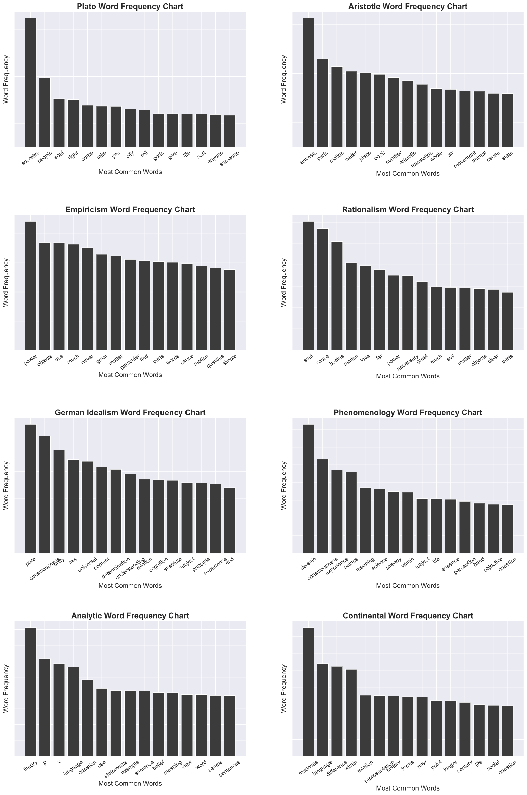

# Philosophy Text Classification
Philosophy may seem like an esoteric discipline, but at it's core a philosophy is an attempt to rationally organize one's worldview. That being the case, if we can identify the features of a school of thought, we can identify a worldview. In this project we use NLP to explore the features of 8 schools of thought from the history of Western philosophy. 

#### Repo Contents
- a [notebook containing EDA](https://github.com/kcalizadeh/philosophy_classification_project/blob/main/EDA_and_NB_model.ipynb) such as word clouds and frequency charts. The same notebook contains our Bayesian and Random Forest models. 
- a notebook containing our [work on bigrams and word2vec modeling. ](https://github.com/kcalizadeh/philosophy_classification_project/blob/main/bigrams_and_w2v.ipynb)
- a notebook containing [preliminary deep NLP modeling.](https://github.com/kcalizadeh/philosophy_classification_project/blob/main/deep_nlp.ipynb) 
- a notebook where you can [input text and have it classified](https://github.com/kcalizadeh/philosophy_classification_project/blob/main/user_input_classifier.ipynb) according to our model.
- a [function.py file](https://github.com/kcalizadeh/philosophy_classification_project/blob/main/functions.py) of functions used in the project.

### Data Sources
Our data spans about 45 texts representing 8 schools of thought. Those schools are:
- Plato
- Aristotle
- Rationalism
- Empiricism
- German Idealism
- Phenomenology
- Analytic Philosophy
- Continental Philosophy

Many of the texts are taken from the Project Gutenberg corpus. Others come from pdfs that have been transformed into .txt files for processing. This transformation unfortunately left errors in the data that needed to be cleaned, with mixed success.

### EDA
Below are word frequency charts for the overall dataset, as well as for each individual school. For the schools we eliminated to the top 50 common words to get a better picture of the individual schools. 

Bigram charts can also be found below for each school.

### Modeling
We were able to achieve 79% accuracy in categorizing sentences from the corpus with a Multinomial Naive Bayes model after correcting for class imbalance via SMOTE. Below is a confusion matrix for the Bayesian model.

While Random Forest methods were unable to achieve the same accuracy (only about 68%), they were able to give us an insight into feature importances, charted below.

### Future Work
There are a number of tasks that would help improve our models or add new features to our work:
- Clean the data more thoroughly. Due to the way the text was formatted after being shifted from pdfs, the data was less than ideally clean, and in ways that were quite difficult to clean - many words would be fused with others or split apart in the text ('aconcept' for 'a concept').

- We also did not have enough time to do as much as we'd like with the neural network side of modeling. Especially for future generative tasks or for more extensive feature analysis, neural networks should be developed.

- It would be nice to expand the function enabling the classification of user-input text to a webapp so that it could be more available to less technically-inclined people.

- Finally, as a kind of extreme goal, we'd like to build a generative model that could create text in the style of a philosopher or paraphrase given text in the style or worldview of a given school.

Thank you!